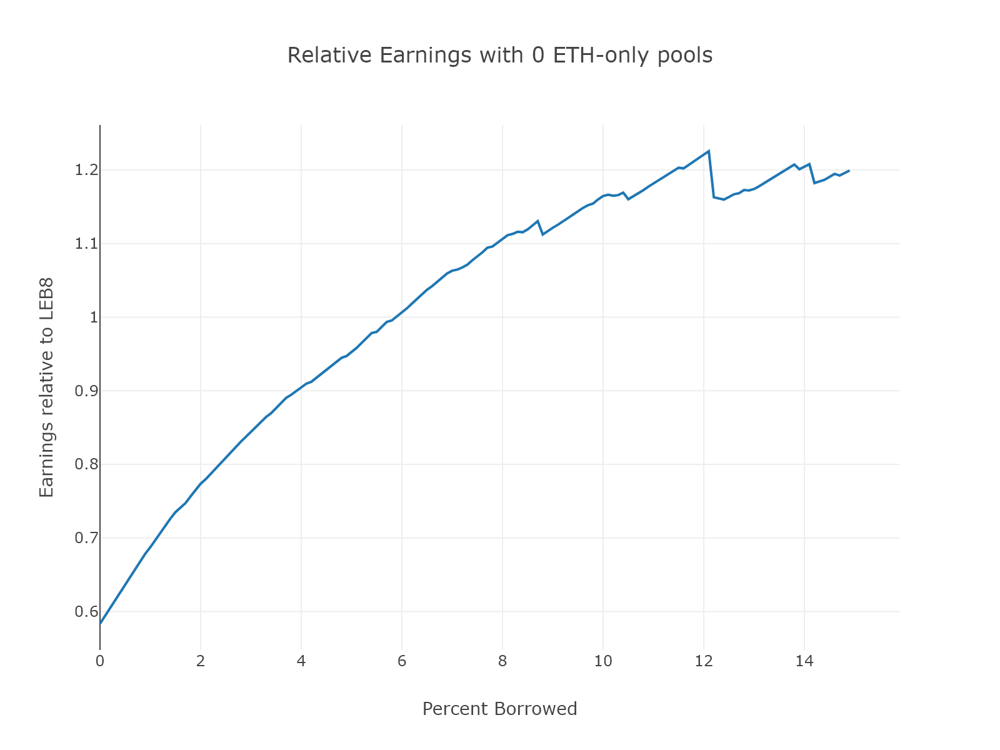
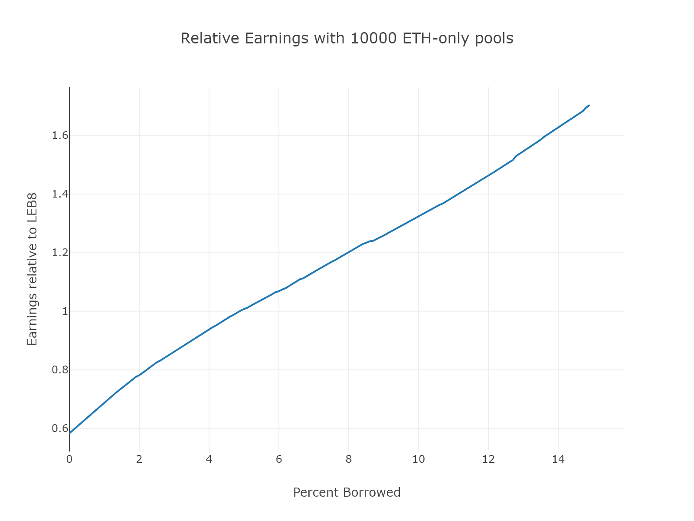
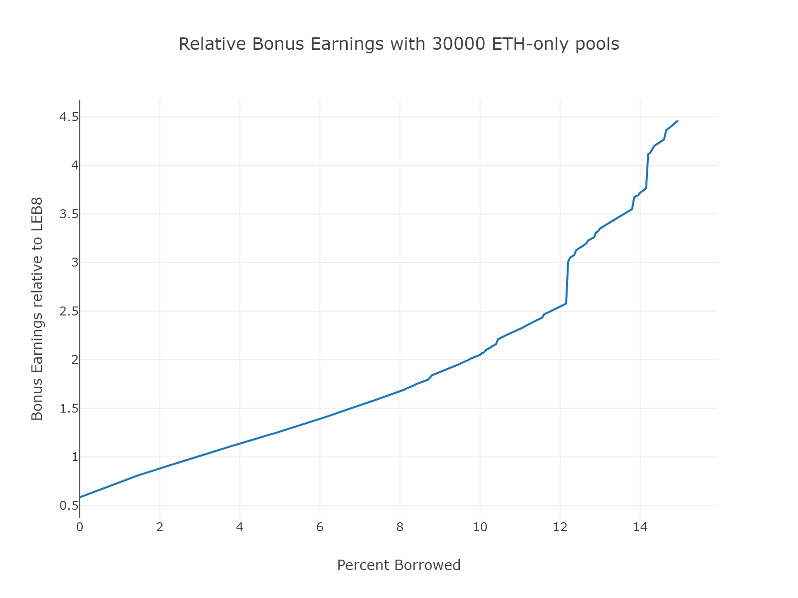
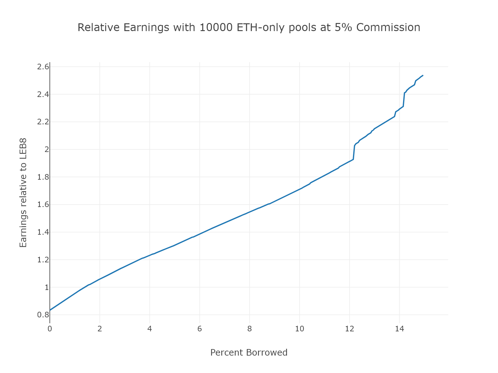
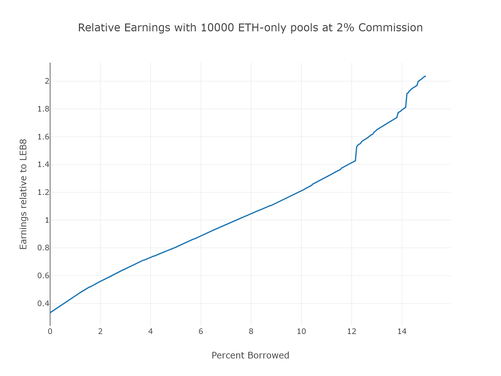
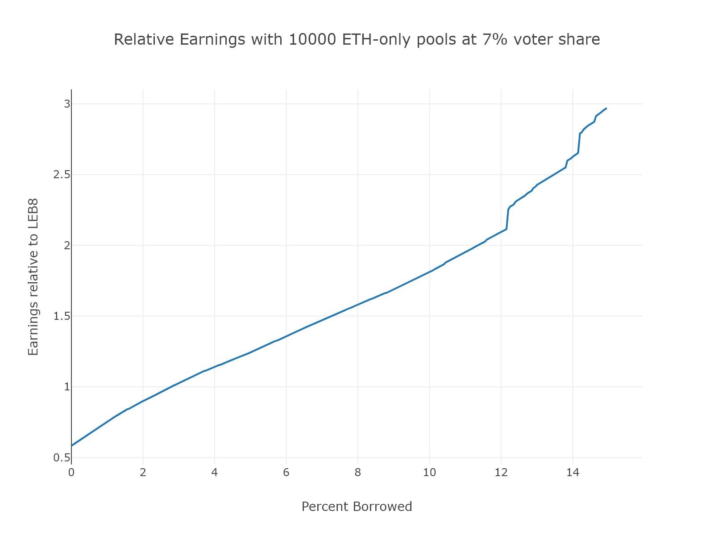

# LEB4 Profitability

## Table of Contents
1. [Abstract](#abstrac)
2. [Goals and Constraints](#goals-and-constraints)
3. [Results](#results)
    * [Changing Inputs](#changing-inputs)
4. [Equations](#equations)
5. [Assumptions](#assumptions)
6. [Should I Reduce?](#tldr)

## Abstract
With the addition of LEB4, ETH-only pools are possible (no RPL stake is required to spin up minipools) and Node Operator commission is being reduced.  RPL stakers also receive a revenue share from all LEB4s based on their staked RPL in megapools - making how profitable running a LEB4 is (as compared to LEB8) a function of your percent borrowed RPL. 

This document is an analysis on how profitable it is to reduce and how the default values for `NO_commission` and `voter_share` were chosen. 

If all you want to know is whether you should reduce, read [here](#tldr).

## Goals and Constraints

You can think of RocketPool as having three goals:
1. Maximize the amount of staked pETH
2. Increase RPL value by sending ETH to RPL value-capture
3. Ensure security of the protocol through encouraging voting and reducing incentives to steal

To maximize staked pETH, we want to make ETH-only pools more profitable than solo staking and we want to encourage LEB8 minipools to reduce to LEB4.  The first of these can be achieved by giving LEB4 minipool owners a share of the commission of pETH, the `NO_commission` (initially set at 3.5%).  However, this commission is not enough to encourage reducing LEB8 to 2xLEB4 on its own (as 0.035 * 56 < 0.14*24). The rest of the incentive must be made up through the voter share.

Their income is going to be a result of:
* The NO_commission, which gives a share of the income on borrowed ETH to the node
* The ETH received for staking RPL, which is function of:
    * The total number of LEB4 minipools
    * The amount of staked RPL that this revenue is being split amongst

See section [equations](#equations) for the exact functions.

We want to incentivize as many current minipools (LEB8) as possible to reduce while:

* Keeping `NO_commission` low so as not to overpay ETH-only pools
* Keeping `voter_share` low so as not to reduce revenue going to RPL value capture (responsible for efficiently increasing RPL value)

We analyze profitability for various nodes with [this python script](./LEB4%20profit.py) that spits out the relative income at LEB4 compared to LEB8 as a function of the percent borrowed RPL.

## Results

Ultimately, a 3.5% node commission and 5% voter share was deemed enough to encourage people to reduce.  While the final profitability is impacted by the amount of ETH-only pools joining the network, a conservative estimate of 10k pools means that everyone with at least 4% borrowed should reduce.  As more ETH-only pools join, this only gets better - with everyone with at least 3% borrowed incentived to reduce at 30k.  Additionally, LEB4 represents the worst case scenario; there is more incentive to reduce if the node is able to run LEB1.5 (the node has at least 8 ETH).

### Changing Inputs

If we change `NO_commission`, we can increase or decrease profitability while causing RPL value to change inversely.  Here are the results of changing the commission. 

Similarly, we could change the voter share.  Here are the results.  

## Equations

$$
\begin{align}
LEB8~profitability &= 1.42* solo~apr \\
LEB4~ profitability &= \frac{NO~commission * 28 + 4}{4} * solo~apr + \frac{min(\%~borrowed, 150)}{total~LEB4~effective~RPL~staked}*ETH_{voter~share} \\
ETH_{voter~share} &= 28*LEB4~minipools * voter~share * solo~apr
\end{align}$$

## Assumptions

Network snapshot last run on June 4th, 2024

8 ETH Node (no LEB1.5)

3.5% commission 

5% voter share 

## The Quick "Should I Reduce?" Summary 
You should reduce if you have at least 4% RPL borrowed at LEB8.  

If you only look at one graph to understand how your earnings would change with reducing, it is this one:

The y-axis is earnings relative to LEB8, with 1 being on par.  Profitability surpasses LEB8 at 5% borrowed, giving everyone above 4% an incentive to reduce.

This assumes that `NO_commission` is set to 3.5%, `voter_share` 5%, 10,000 ETH-only pools join, and everyone with *more* percent RPL borrowed than you also reduces.

