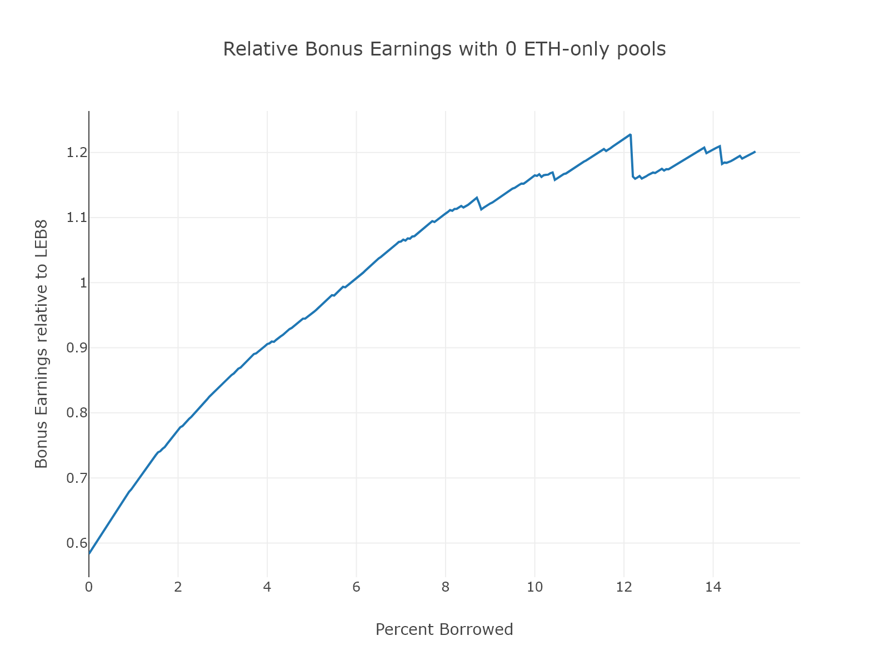
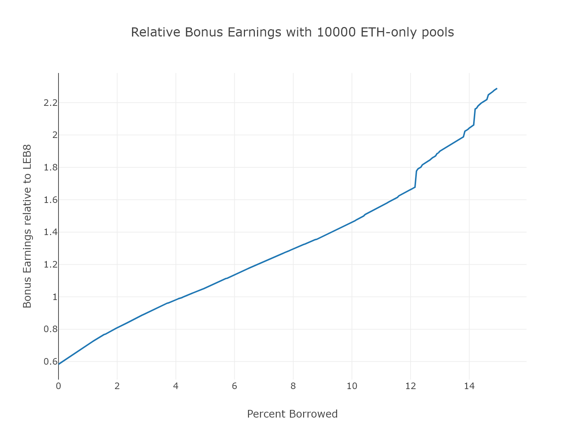
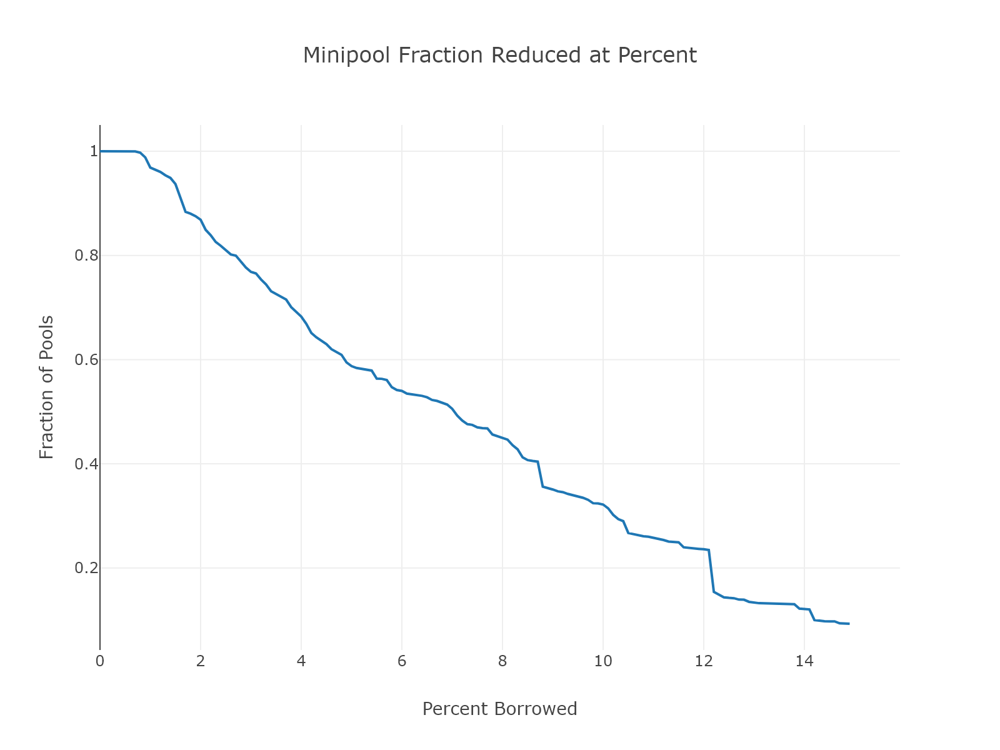

[LEB4](./LEB4%20profit.py)

# LEB4 Profitability

## Table of Contents
1. [Example](#example)

## Example

test 

## Background
With the addition of LEB4, ETH-only pools are possible (no RPL stake required) and Node Operator commission is being reduced.  NOs also receive a revenue share from all LEB4s based on their staked RPL - making how profitable running a LEB4 is (as compared to LEB8) a function of your percent borrowed RPL. 

If all you want to know is whether you should reduce, read [here](#tldr).

## How the Variables were Chosen

Before sublinear bonding is possible a Node runs the risk of 2x LEB4s making less in commission than a single LEB8.  In order to encourage nodes to reduce we need to ensure that the income they receive from commission and voter share is greater than their income from LEB8.  We want to do this while:

* Keeping `NO_commission` low so as not to overpay ETH-only pools
* Keeping `voter_share` low so as not to reduce revenue going to RPL value capture (responsible for efficiently increasing RPL value)

We analyze profitability for various nodes with [this python script](./LEB4%20profit.py) that spits out the relative income at LEB4 compared to LEB8 as a function of the percent borrowed RPL.

### Results

Ultimately, a 3.5% node commission and 5% voter share was deemed enough to encourage people to reduce.  While the final profitability is impacted by the amount of ETH-only pools joining the network, a conservative estimate of 10k pools 

### Equations

$LEB8~profitability = 1.42* solo~apr \\
LEB4~ profitability = \frac{NO~commission * 28 + 4}{4} * solo~apr + \frac{min(\%~borrowed, 150)}{total~LEB4~effective~RPL~staked}*ETH_{voter~share} \\
ETH_{voter~share} = 28*LEB4~minipools * voter~share * solo~apr$

Percent Borrowed from LEB8
3.5% commission
5% voter share

## Various Options

## The Quick "Should I Reduce?" Summary 
You should reduce if you have at least 5% RPL borrowed at LEB8.  

If you only look at one graph to understand how your earnings would change with reducing, it is this one:

The y-axis is earnings relative to LEB8, with 1 being on par.  Profitability surpasses LEB8 at 5% borrowed, giving everyone above 5% an incentive to reduce.

This assumes that `NO_commission` is set to 3.5%, `voter_share` 5%, 10,000 ETH-only pools join, and everyone with *more* percent RPL borrowed than you also reduces.