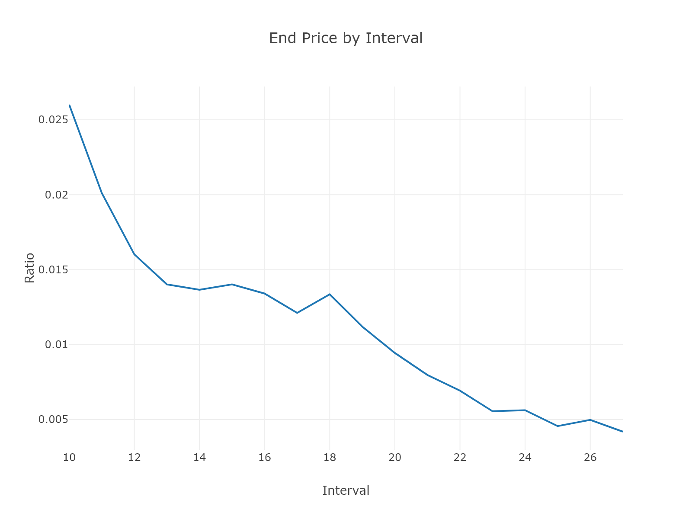
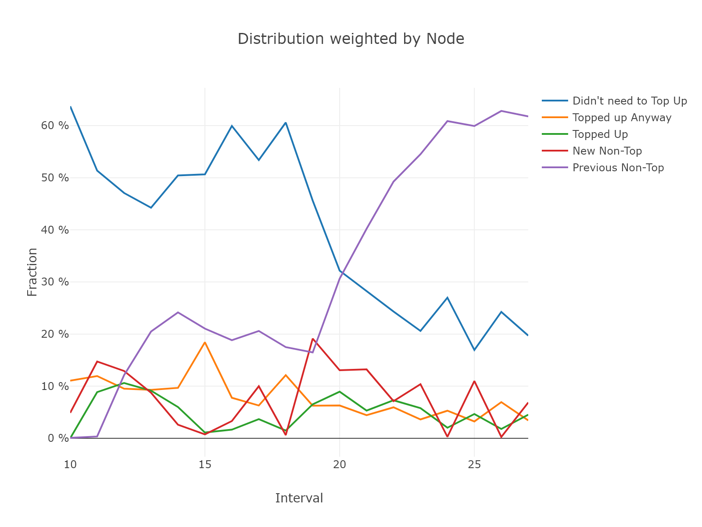
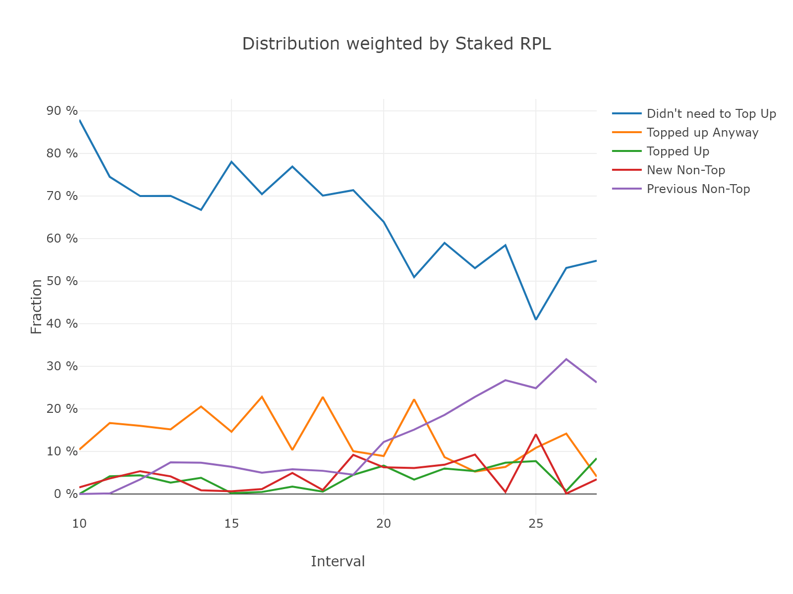
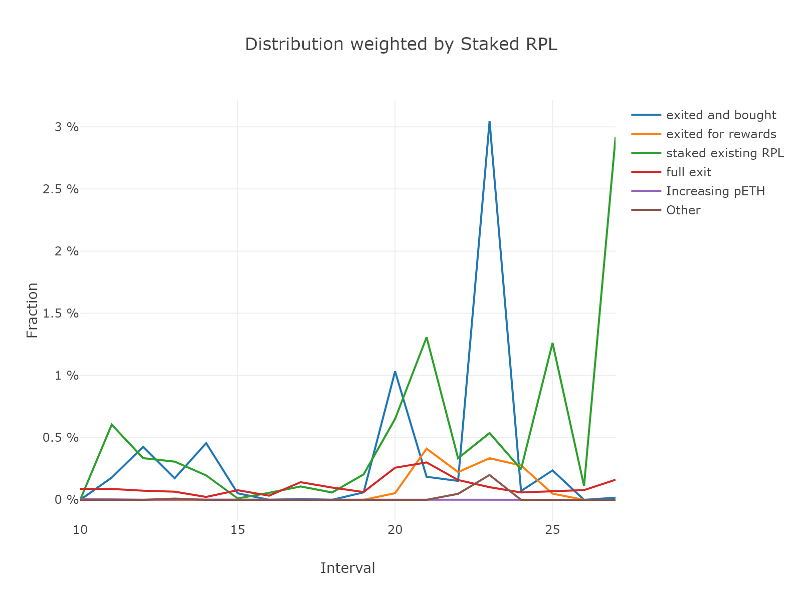
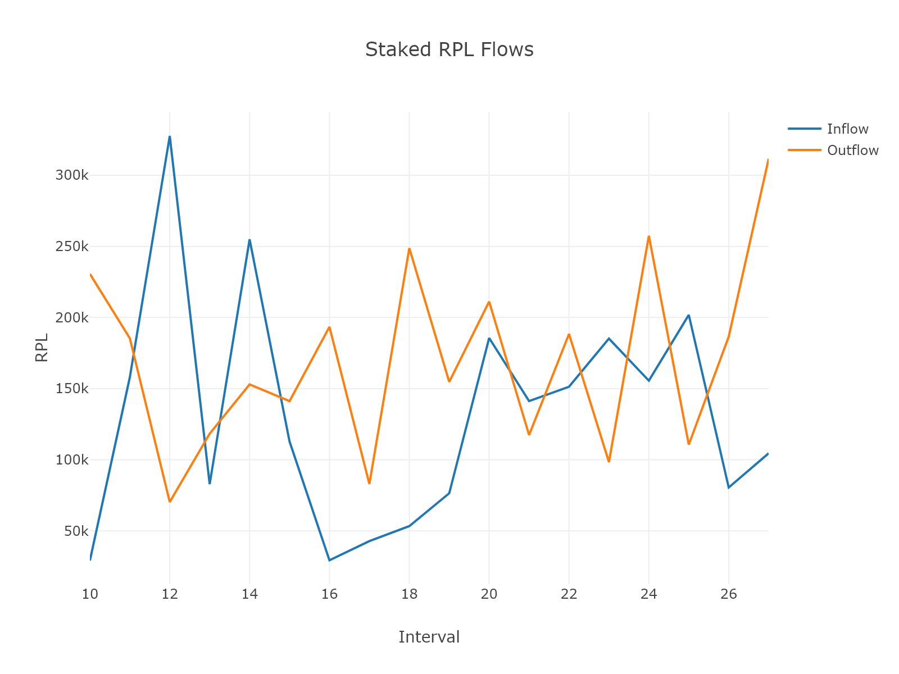
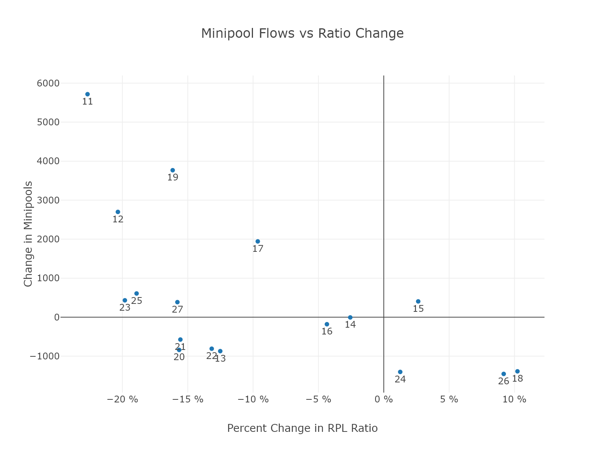
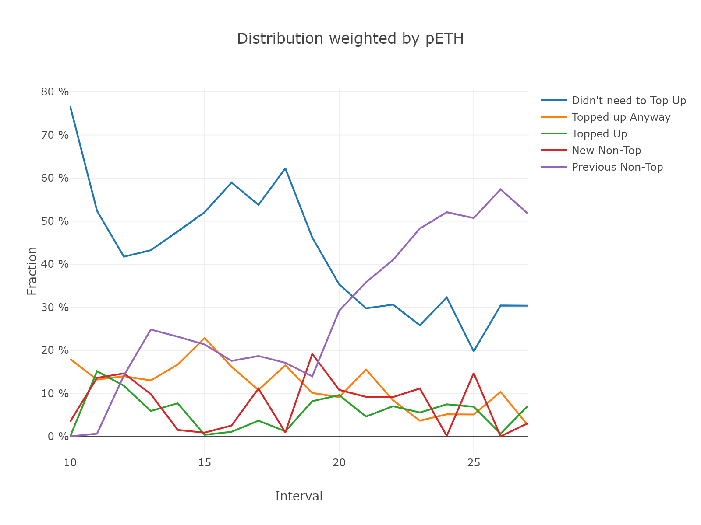
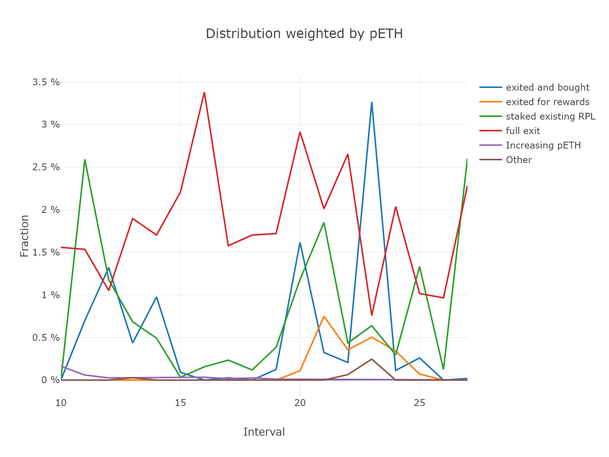

[MEV Script](./distribution_analysis.py)

# Distribution Analysis
sckuzzle

# Context
When coming up with tokenomics changes arguments are often made on how node operators would change in their behavior under the proposed system.  If we want to make arguments like this, we should really know what the current node operator behavior is and has been historically.  This analysis breaks down behavior into the following buckets and looks how they change over time: 

* Nodes that didn't need to top up 
* Nodes that didn't need to but did anyway
* Nodes that needed to top up and did
* Nodes that exited and topped up
* Nodes that exited to get RPL rewards (but didn't top up)
* Nodes that fully exited
* Nodes that freshly didn't top up 
* Nodes that didn't top up previously either
* Nodes that grew pETH
* Other (like increasing nETH while being below cliff)

It also looks at how this distribution changes when you weight by nodes vs staked RPL vs node size (nETH and pETH).

It builds off of work I did to create historical staking snapshots for each interval [here](https://github.com/sckuzzle/rp-snapshot).

## Prices

We expect node behavior to change depending on whether RPL ratio is increasing or decreasing and by how much.  Plots are included for your reference.

Note that this analysis only looks at change across one interval and not across many.

# Results

## Weighted by Nodes

The dominant behaviors are clearly not needing to top off (which dwindles as ratio falls) and never topping up.

Zooming in, we find that ~2-5% of NOs are full exiting each period and around 6% top up, although it varies a lot.  

## Weighted by Staked RPL

## Weighted by Node Size (nETH)

## Staked RPL in- and out-flows

## Correlations 
While there is a correlation between price change and staked RPL or number of minipools, it is hard to account for other factors like sentiment and market context.

## Weighted by Node Size (pETH)
For completeness, here is weighting by pETH.

