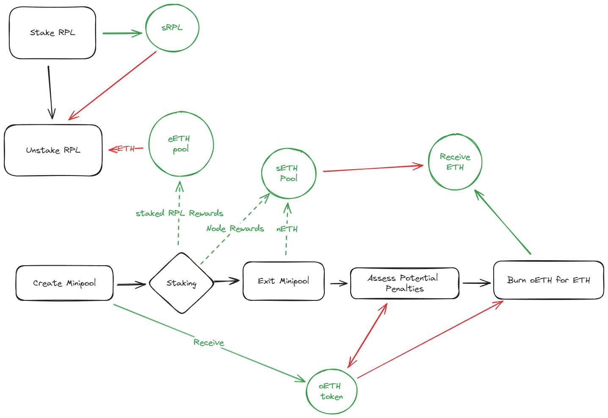

# Value-Accruing Tokens for NOs

## Rationale
One of the most significant impediments to profiting off of staking is taxes.  In the United States approximately 45% of all profits from staking must be paid back as taxes.  Reducing this percentage is the most important factor in increasing profitability - even moreso than commission.  

It is possible to reduce taxes paid by changing the structure of how profits are collected.  While current NO income is considered ordinary income (and subject to the ~45% taxes), "income" from rETH is taxed at 15% (when held >1 year) because it is considered long-term capital gains rather than ordinary income.  Changing the structure to classify NO income as capital gains will significantly increase profits, particularly in the long term (untaxed gains can compound).

If we compare two LEB8s both at 14% commission where one is taxed at the capital gains rate and the other ordinary income, their ending capital should they exit and pay all taxes would look like the following:

The difference is entirely attributable to reduced taxes paid using the long-term capital gains scheme.

Note that this includes partial-restaking (a person with a large amount of validators can spin up new validators with the rewards).  

## Value-Accruing with Current RPL Tokenomics

The easiest method of creating a value-accruing token is to apply the rETH methodology to node operators.  When a node operator creates a minipool, they are given an Operator ETH token (oETH) which is not transferable and can be redeemed at a future date.  **All** rewards from the operation of this minipool are sent to a sETH pool (Socialized ETH).  Upon exiting the minipool the NOs portion of the ETH is also sent to the pool, any penalties (if applicable) are assessed, and the oETH token is automatically burned, yielding ETH which is sent to the operator.  

Just as with rETH, the amount of oETH initially received and the amount of ETH yielded upon burning varies with time as the exchange rate changes.  The only taxable event occurs when the minipool is exited.

This system would also require some kinds of penalties framework and watchdogs.  If a node is significantly underperforming or stealing, their oETH needs to be slashed.  Also note that all rewards are only available upon exiting the minipool; this is a requirement for the income to be considered capital gains rather than income.

### Math

TBC

### Possible Issues

Ideally we would include a mechanism by which the ETH in the NO ETH pool can be (re-)staked.  This allows ETH income from validating to be used for additional validators.  While one could imagine a credit-system which allows a NO to spin up new nodes, it is unclear what the tax implications would be and how to incentivize this.  Does the NO burn oETH, spin up a new node, and immediately receive additional oETH?  How would this NO then accrue rewards faster?  

It is important that the oETH is immediately burned for ETH upon exiting a validator.  We do not want a NO to hold onto oETH when they are no longer validating, holding on to accrued rewards.  Exiting a validator does not cause a smart contract execution, so we may require some mechanism by which anyone can execute the burn in exchange for a finders fee after a certain amount of time.

## Value-Accruing with RPL-rent

NOTE: DUBIOUS TAX STATUS

In order to allow for the expansion of Rocketpool through the creation of no-RPL-minipools, it is being considered to use RPL as a rent-extracting token.  Under such a system, no RPL is required to spin up a minipool, and the NOs get to keep a smaller commission.  The NOs scheme could either use the value-accruing scheme as above or it can use the current RP dynamics.

As above, a portion of staking rewards goes to the sETH pool - but this time, it's smaller (current estimates suggest around 3%).  The remaining commission (~11%) would go a different pool held in reserve for RPL stakers: eETH.

The value-accruing rent-extraction model works by allowing for the staking of RPL and receiving a sRPL token in return (as above, non-transferable).  You hold this token for some time, until a point in which you burn (unstake) the token in return for your RPL back in addition to a portion of ETH from the eETH pool.  

### Possible Issues

There is a good chance that this may not qualify as a capital gains tax.  I need to do more reading.

## Discarded Implementations

### Individualized Income

Instead of there being a single oETH token that is granted, a separate token could be made and granted for each minipool that comes online.  This allows for tracking the rewards from each individual minipool rather than socializing the rewards.  

This has the unfortunate effect that it will not be possible to gather rewards from many minipools in order to generate the capital to spin up another minipool.

#### Possible Issues

I am not a tax professional.  This method is less likely to be recognized by the government as "valid".  We should find someone to evaluate it and determine how likely it is to work. 

