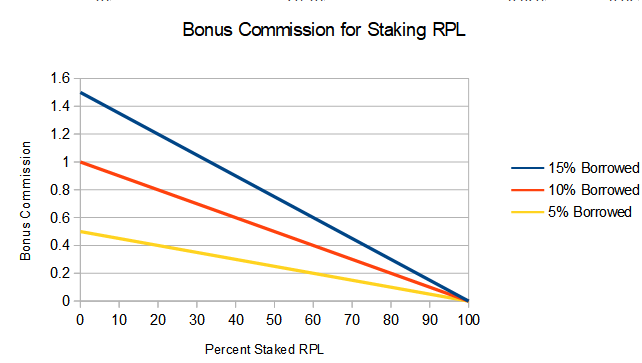

# RPL Buy and Burn

This proposal covers sckuzzles proposed value-capture via buy and burn of RPL, resulting in a value-accruing token.

Note: This version accrues value to all RPL tokens.  For a version that accrues value only to staked RPL (at the cost of complexity), read [here](./value-accruing-token.md). 

## Commission Rates

With this proposal there would be no RPL requirements to spin up a new minipool.  Instead, a portion of the commission is redirected towards the protocol.  Four knobs that can be adjusted are:

* Commission to Node Operators (NO)
* Commission to Protocol (for use in RPL burn)
* Increased commission to nodes with staked RPL
* RPL Inflation rate to fund protocol development

with all remaining ETH going towards rETH.

NO commission can be controlled by Universal Variable Commission (to ensure rETH and NO demand are balanced).  Increased commission to staked RPL should be used to ensure enough RPL is staked for governance (see Node Operators section).  RPL inflation for the protocol can be voted on by the pDAO, and should trend down with time.  This leaves commission to the protocol (for burning).

### Commission to Protocol Rate

When the tokenomics rework is first released, we want to use this time to generate hype and trigger as many people as we can to switch to RocketPool rETH.  We can entice more people by giving them favorable (temporary) rates at the start which decrease over time.  People tend to make changes only when an activation energy has passed, so we want to give them every reason to change at the start.

This can be done by decreasing the burn rate, ramping up with increased market share or time.  When either criteria is met, the burn rate can increase.  An example is below:

| Market Share  | Number of Days Passed | Commission to RPL Burn |
| -------- | ------- | - |
| - | - | 1 % |
| 5% | 60 days | 3% |
| 10% | 180 days | 6% |
| 15% | 360 days | 8% |
| 20% | NA | 15% |
| 25% | NA | 22% |
| 30% | NA | 30% |

Note that with UVC, an increase in RPL burn means a decrease in rETH flow, which will correlate with a decrease in commission to node operators.  Therefor higher burn rates help to limit the protocol from both rETH flow and operator commission.

## Node Operators

We want to retain governance incentives in which nodes stake both RPL and ETH in a way in which they are awarded for it and have incentives aligned to the protocol.  In order to encourage staking the two together and aiding in governance, additional commission is offered.  The commission is proportional to the product of the node's percent borrowed and the percentage of unstaked RPL *in the protocol*.  

$bonus~commission = k * \%~borrowed * \% unstaked~RPL$

I would suggest a value of k between 0.01 and 0.02.  The percent borrowed caps out at 15%, which means that the maximum bonus commission is 0.01 * 0.15 * 1.0 = 0.015, or 1.5 p.p. (using a k of 0.01).

This system should mean that it is always beneficial to stake more RPL and ETH and there is no value in sybilling.  A potential variant is to apply diminishing returns above 15% a la RPIP-30.  

Note:  Assumes LEB8 numbers.  We may want to scale this down with ULEB1.5 being possible.  

## Purchase Mechanism

I haven't put significant thought into this.  [Valdorff's Buying Mechanism](https://github.com/Valdorff/rp-thoughts/blob/main/2024_02_strategy/readme_tier2.md) seems like a good consideration.

## Governance

In order to minimize how much the protocol needs to change, governance being concentrated in nodes staking both ETH and RPL is being retained.  We do not need to redefine what staked RPL is or how much vote power is needed with this proposal.  

### Staked ETH Flow

It is desired to keep ETH flow to this portion as small as possible, as it is taxed as ordinary income (and thus NOs see less of it compared to ETH flow to buy/burn).  I suggest we allocate 1 p.p. to stakers when <50% of RPL is staked, decreasing to 0.3 p.p. at 100% staked RPL.  

## Protocol Funding

The protocol funding will still, at least initially, be funded through RPL inflation rather than through ETH-diversion.  This allows expenditure to be stable, reliable, and exceed commission if necessary.  It is possible that when the protocol nears maturity that a portion of ETH can be portioned off and inflation set to 0.  

RPL inflation is to be capped at 1.5% of RPL in circulation (not burned) per annum, and can only be changed with a pDAO vote.  The distribution of these funds remains the same (sans NOs getting a portion).

